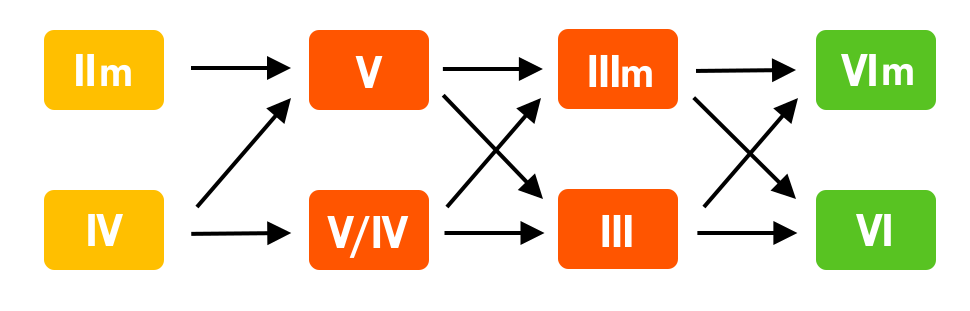

#  0好和弦/乐理笔记

> 材料来源：好和弦，爱音乐理，[自由派乐理][https://music-theory.aizcutei.com/]

## 节奏

3/4 4/4 2/4等简单拍子。9/8为复合，三个一组。同理12/8，6/8。

更复杂（无法简单整除）：5/4拍，7/4等

## 音程、调性、音阶

### 音名

唱名作相对音名，音名作为绝对的标准（CDEF不变）

主音	Tonic
上主音	Supertonic
中音	Mediant
下属音	Subdominant
属音	Dominant
下中音	Submediant
导音	Leading Tone

### 音程

音程：1，4，5，8为减-纯-增 (dim-perfect-aug)，2，3，6，7为减-小-大-增(dim-min-maj-aug)

1-根tonic，4-附属sub-dominant，5-属dominant

### 音阶

#### Pentatonic 五声音阶/布鲁斯

去掉Ionian中的4、7级音（换到小调就是去掉了2，6级）。也是中日常见的音阶。

宫调/大调五声：CDEGA，Ionian

羽调/小调五声：ACDEG，Aeolian（1，b3，4，5，b7）

里面均没有特征音（大调4，小调6）

布鲁斯：大调+小调五声 => 1，2，**b3**，3，4，5，6，**b7**，7 （加粗：Blues音）

大调blues：

- Imaj7 -> I7：1，3（大调特征），5，b7（特征）
- IVmaj7 -> IV7：1，3，5，b7
- V7无变化
- 其他无变化

### 调式 Mode

**大小调只是一种调式**，一共常见八种

#### 七种调式

C-B分别做主音：

Ionian, Dorian, Phrygian, Lydian, Mixolydian, Aeolian, Locrian

我的霹雳猫阿洛

I D P Ly M A Lo

##### Ionian,即大调

大三明快，小三悲伤，小三降六：1-b3-5-b6（电影紧张感）

##### Dorian 2级 多利亚

**小调**六度由小六度改为大六度（I,II,**IIImin**,IV,V,VI,**VIImin**），神圣感，悠扬？

**首音以小调首音为准**，不要找到关系大调去了。关系大调是Lydian

例：斯卡波罗集市，Blue Fields

##### Phrygian 3级

降2，3，6，7。二级音有小二度

更常用的升高3级的 **Phrygian Dominant**，降2，6，7（其刚好是Db大三）

##### Lydian 4级

C开始只有#IV，可以认为是#4的**大调**。

其音阶全部在一起是Cmaj13(#11)，梦幻感。可以在C，D间切换有史诗感

##### Mixolydian 5级

C开始只有b7，也接近大调。135b7组成属七C7。（大小七和弦）

##### Aeolian，6级。即小调

悲伤（一般），降3，6，7。

##### Locrian 7级开始

黑暗，b2，3，5，6，7，主和弦是一个Cdim。悬疑

### 五度圈

调性五度叠加，升降号保持音程结构依然是**全全半全全全半**。

**大调部分**，左半(F)-C-G-D-A-E-B-(F#-C#) （五度叠加），升号增加为同顺序，从G开始FCGDAEB。

右半逆向考虑为(C)-F-Bb-Eb-Ab-Db-Gb，向下四度（反向），降号添加顺序为前面一组，B-E-A-D-G-(C)。

右半正向考虑，因为叠五度有BC一个半音所以走到了F#，变为Gb，顺序为(E-F#)/Gb-Db-Ab-Eb-Bb-F-C，

降号为减少顺序，从Gb降GABCDE，到Db开始减少降号，顺序为对向的CGDAE。

**小调部分**，找对应关系小调即可（共用音的小调，即从大调六级音起，反之，关系大调是小调的三级音）。

**若是从五线谱找调需要先判断大小调**，不然会找到关系大调。

**由于五度堆叠**，**可以直接在这个音的两边找到下属和属。**

## 和声

### 和弦种类

#### 三和弦Triad

构成：I,III,V级音

| 和弦名称           | 三音类型        | 五音类型        | 相对根音音程组合 |
| ------------------ | --------------- | --------------- | ---------------- |
| **大三和弦 (Maj)** | 大三度（4半音） | 纯五度（7半音） | 例：C–E–G        |
| **小三和弦 (min)** | 小三度（3半音） | 纯五度（7半音） | 例：A–C–E        |
| **增三和弦 (aug)** | 大三度（4半音） | 增五度（8半音） | 例：C–E–G♯       |
| **减三和弦 (dim)** | 小三度（3半音） | 减五度（6半音） | 例：B–D–F        |

#### 七和弦Seventh

**会模糊三和弦的强烈色彩**，省略去五级叫shell和弦

构成：**根音（I）、三音（III）、五音（V）、七音（VII）**

大三和弦 + 大七度 -> 大七

小三和弦+小七度 ->小七

大三 + 小七度 -> 属七（在属音上才有特殊效果）

减三 + 小七度 ->半减七

减三 + 减七度 ->减七

| 和弦名称              | 三音类型        | 五音类型            | 七音类型             | 相对根音音程组合 | 例子      |
| --------------------- | --------------- | ------------------- | -------------------- | ---------------- | --------- |
| **大七和弦 (Maj7)**   | 大三度（4半音） | **纯**五度（7半音） | 大七度（11半音）     | 1–3–5–7          | C–E–G–B   |
| **小七和弦 (min7)**   | 小三度（3半音） | **纯**五度（7半音） | 小七度（10半音）     | 1–♭3–5–♭7        | A–C–E–G   |
| **属七和弦 (Dom7)**   | 大三度（4半音） | **纯**五度（7半音） | 小七度（10半音）     | 1–3–5–♭7         | G–B–D–F   |
| **半减**七和弦 (m7♭5) | 小三度（3半音） | **减**五度（6半音） | **小**七度（10半音） | 1–♭3–♭5–♭7       | B–D–F–A   |
| 减七和弦 (dim7)       | 小三度（3半音） | **减**五度（6半音） | **减**七度（9半音）  | 1–♭3–♭5–𝄫7       | B–D–F–A♭  |
| 小大七和弦 (minMaj7)  | 小三度（3半音） | 纯五度（7半音）     | 大七度（11半音）     | 1–♭3–5–7         | A–C–E–G♯  |
| 增七和弦 (aug7)       | 大三度（4半音） | 增五度（8半音）     | 小七度（10半音）     | 1–3–♯5–♭7        | C–E–G♯–B♭ |
| 增大七和弦 (augMaj7)  | 大三度（4半音） | 增五度（8半音）     | 大七度（11半音）     | 1–3–♯5–7         | C–E–G♯–B  |

#### sus, add, inversion

Sus2/4：将三级替换为2/4级

Add：添加任何

转位/Bass：将转位后的低音音写在slash后

#### 属和弦

**三全音替代**：减五度倒转后为增四（tritone）。那么一个V级和弦内三、七级音为减五度，在bII级中他们会互换成增四度。叫**降二代五**

自然大调下V7为主属和弦。称为主音的属和弦。

#### 副属和弦 Secondary Dominant Chord

除I、VII之外，**其他音和弦叠加其的五级**的属七和弦为副属和弦，如C下Dm7的副属和弦为A7，记做**V7/ii**，意为二级音的五级属七和弦。五级音叠加其之上五级为**重属和弦**，如C下G的五级属七是D7，此时D7记做**V7/V**

如果对其叠加了多个属和弦，就为**扩展属和弦**，如下，

E7-A7-D7-G7-Cmaj，向左依次五度。此时将A7，G7做三全音替代就会变成E7-Eb7-D7-bD7-Cmaj，此时**只差距一个半音**

### 和弦功能

#### 自然大调

主功能：稳定性：I > IV > III 

属功能：V 最不稳定 （七和弦内III -> VII会有一个减五度）

下属功能：稳定性：IV > II

无功能：VII

看和弦内的不稳定音数量，有共有音的和弦也更有相近趋向

#### 小调/自然小调

特征音：**bIII（小调特色），VI（在自然小调bVI）**，bVI级音也是小调特征。

那么找含有小调特征的dom7和弦。

**下属功能**：

- IIm7b5 二级半减七 II, bIV，**bVI**，I （首调写法1, b3, b5, b7)
- IVm7 四级小七，IV, **bVI**, I, bIII（首调写法1, b3, 5, b7)
- bVImaj7 bVI级大七，**bVI**, I, III, VI（首调写法1, 3, 5, 7)
- bVII7 bVII级属七（因为没有属功能可以叫**大小七**和弦），bVII7, II, IV, bVI（首调写法1, 3, 5, b7)

**主功能**：Im7, bIIImaj7, Vm7

**无属功能**

#### 和声小调

将七级还原后，原本Vm7由V, bVII, I, IV（首调1, **b3**（到根音的小七度）, 5, b7）变成V, VII, I , IV（首调1，**3**（到根音的大七度），5，b7），有了**属功能**，所以称和声小调。

1，2，b3，4，5，b6，**7**。古典上音阶的下行还原。**和声调式**

此时一级音的七和弦变成了IminMaj7（小大七和弦）: (1，b3，5，7)。**现在有属功能了**。不过大部分情况下只会基于自然小调改V7。

不过2，b3，5，b6，7，1会产生三组减二度。于是把6也还原产生**旋律小调**，只有b3。

### 延伸音

在三、七和弦上继续叠加音就会产生9、11、13度音，也就是高八度的2、4、6度音。称作延伸音/Tension。

这样直接在大七和弦之上标记更灵活，可以挖掉其中几个音。**I△7^(9,11,13)^**就代表加9，11，13音。（实际上这些音完全可能放在原八度，例如11音实际在四度起到sus4作用，但是如果有小二度就很不和谐，见下。）

#### 异名同音

+11th和-13th，你会发现它们位于5th的半音上下，所以它们和升五和降五是异名同音的关系

类似地，+9th，它的声音和小和弦中的3rd一样。

这样，+9可以制造一种大小混合的听感。例如III7(+9)，有点微妙，抵消了位移，听感比较模糊介于各种之间。

一个小表格：

| 延伸音 | 换句话说 | 相似的角色 |
| ------ | -------- | ---------- |
| 9    | M2   | sus2 |
| 11   | P4   | sus4 |
| 13   | M6   | 六和弦 |
| ♯9   | m3   | 抵消位移 |
| ♭9   | -    | 无   |
| ♯11  | ♭5   | 降五 |
| ♭13  | ♯5   | 升五 |

对于大调音阶中的自然和弦（即 Imaj7、IIm7、IIIm7、IVmaj7、V7、VIm7、VIIm7b5）：

**规则：延伸音不能与和弦的三音形成小二度冲突。**

例如：

- 在 **Cmaj7 (C–E–G–B)** 中：
  - 可用 9(D)、13(A)
  - 不宜用 11(F)，因为 F 与 E（三音）形成小二度冲突。

因此：

> **Cmaj7 可扩展为 Cmaj9 或 Cmaj13，但不宜写作 Cmaj11。**

#### 借用自小调的自然和弦

当你在大调环境中使用来自**平行小调**的和弦（借用和弦）时，可用拓展音要参考**该和弦所属调式（mode）**。

例如：

- **Cm7**（借自 C 小调）包含：1, ♭3, 5, ♭7
  - 可加上 9(D)、11(F)、13(A♭)
  - 注意此时 11(F) 与 ♭3(E♭) 是 **大二度**，没有冲突 → 可用！

#### 延伸音与调式的关系（调式来源法）

常用的记忆方式：
 每种七和弦，都有一个最“自然”的调式来源，对应那种调式的所有可用延伸音。

| 和弦类型      |     对应调式      | 音级结构                | 可用延伸音            |
| ------------- | :---------------: | ----------------------- | --------------------- |
| **Maj7**      |    **Lydian**     | 1, 2, 3, ♯4, 5, 6, 7    | 9, ♯11, 13            |
| **m7**        |    **Dorian**     | 1, 2, ♭3, 4, 5, 6, ♭7   | 9, 11, 13             |
| **7（属七）** |  **Mixolydian**   | 1, 2, 3, 4, 5, 6, ♭7    | 9, 13（但 11 常避免） |
| **m7♭5**      |  **Locrian ♮2**   | 1, 2, ♭3, 4, ♭5, ♭6, ♭7 | 9, 11                 |
| **mMaj7**     | **Melodic minor** | 1, 2, ♭3, 4, 5, 6, 7    | 9, 11, 13             |

**小调和弦中 9、11、13 的适用情况**

- 在 “Chord extensions and alterations” 一文中指出：

  > “On a minor 7 chord … you can use 9’s and 11’s and both sound awesome … You can occasionally use a 13 on a minor chord but it will really stick out as it rubs against the flat 7.” [The Jazz Resource](https://www.thejazzresource.com/chord_tensions.html?utm_source=chatgpt.com)
  >  也就是说：在 m7 和弦上，9 和 11 是比较自由／常用的；13 虽然可用，但要小心音响是否冲突。

- 在 “Available tensions” 的表格中，也提到：某些和弦类型（包括 m7）有它们“可用张力音”的推荐。 [thejazzpianosite.com+1](https://www.thejazzpianosite.com/jazz-piano-lessons/jazz-chords/available-tensions/?utm_source=chatgpt.com)

**为什么小调与大调和弦的延伸音选择不同**？

- 因为调式／音阶来源不同。资料 “Everything You Don’t Know About Minor Harmony in Jazz” 提出，在小调环境中，仅用自然小调（Aeolian）往往“驱动力”不足，需要借助如和声小调 (harmonic minor)、旋律小调 (melodic minor) 等才能产生更强的和声推进感。 [Jazzadvice](https://www.jazzadvice.com/lessons/minor-keys-and-harmony-in-jazz/?utm_source=chatgpt.com)
- 此外，“Avoid note” 条目指出：在大调模式或小调模式中，有些音因为与和弦内的音形成“半音”关系（小二度）或“混淆三音／七度”的功能而被归为 “avoid notes”（应避免用的音）。例如，在小调模式中第6级有时被视为 avoid note。 [维基百科](https://en.wikipedia.org/wiki/Avoid_note?utm_source=chatgpt.com)

**小调和弦中推荐用与避免用的延伸音总结**

基于以上资料，我们可以整理如下（以 m7 / m7(9) / m11 为例）：

| 延伸音           | 一般适用？ | 备注                                                         |
| ---------------- | ---------- | ------------------------------------------------------------ |
| 9（即音阶的2级） | ✅ 常用     | 与根音及三音通常冲突少，能增加色彩。                         |
| 11（4级）        | ✅ 常用     | 特别在小调和弦中，11不会与大三度冲突（因为小调是小三度），所以效果佳。资料中说 “Over major chords, elevenths can be chaotic … Over minor chords, they’re beautiful.” [flypaper.soundfly.com+1](https://flypaper.soundfly.com/write/an-intermediate-guide-to-chord-tones-and-tensions/?utm_source=chatgpt.com) |
| 13（6级）        | ⚠️ 有时用   | 可用，但要看具体和弦音／安排是否造成与♭7或其他音冲突。资料提示在 m7 上，13 “会真的突出，因为它可能擦到 flat 7”。 [The Jazz Resource](https://www.thejazzresource.com/chord_tensions.html?utm_source=chatgpt.com) |
| 11 在大调和弦上  | 🚫 通常避免 | 因为会与大三度构成小二度冲突。资料说明大三度和11度（4级）常有冲突。 [The Jazz Resource+1](https://www.thejazzresource.com/chord_tensions.html?utm_source=chatgpt.com) |

**若结合调式来源来看：小调和弦的“可用张力音”推荐法**

- 如果是 **m7 和弦**，你可以把它看作来自如 Dorian mode（若为自然小调/平行模式）或其他小调变体。根据调式，9、11、13往往是“可用”的。资料中就提到 “minor 7 chords … especially when using a Dorian scale … 13th can be used”. [flypaper.soundfly.com+1](https://flypaper.soundfly.com/write/an-intermediate-guide-to-chord-tones-and-tensions/?utm_source=chatgpt.com)
- 若为 **mMaj7**（小调大七和弦）或是使用旋律小调／和声小调的和弦，则可用的延伸音可能更多或特殊。
- 重要：在小调和弦使用延伸音时，仍应检查你所用的音不会与三音（♭3）或七度、根音、五度构成“令人不悦”的冲突（例如小二度）。

------

## 4. 实例说明

举个例子：假设我们有一个 Cm7 和弦（C–E♭–G–B♭）

- 可添加 9 → D，得到 Cm9（C–E♭–G–B♭–D）
- 可添加 11 → F（即音阶的4级）得到 Cm11（C–E♭–G–B♭–D–F） — 在这个小调情境下，F 与 E♭（♭3）是大二度（不是小二度），冲突少，因此合理。
- 添加 13 → A♭ (音阶6级) 得到 Cm13（C–E♭–G–B♭–D–A♭） — 能用，但要听音响是否饱满、与 B♭（♭7）/G（5度）有没有问题。

-----

### 和弦进行

#### 布鲁斯进行

大调：第三句后半1625，1645回转进入下部分

小调下调式转换主要在小调，依然1，4，5为主体。5用了和声小调。这个bA7是重属和弦，对IV级进行三全音替代。也可以多利亚

- **纯五度**跨度很大，可以上下，下行到副属音，爵士常见
- **大二度**（IV-III-II-I）Neo Soul很多
- **大三度**：三度下行极多用来作为爵士节奏线（C-A-F-D-B-G-E)
- **互相替换**：主、下属之间互相替换

#### 终止式

- 正格终止 V -> I 终止 (例：G7-C)，小调下也会喜欢把IIIm改成III然后III->VI
  - 更完全的终止式：II-V-I，或IV-V-I（柔和），II7-V7sus4-I7（属七sus4削弱了三全音）
  - 251进行：最有音阶色彩
    - 大调下：IIm7-5-V7-Imaj7
    - 小调下：IIm7-5-V7b9-Im7
  - **解决**：紧张->稳定，多认为下属，属走向主。**最强解决：V->I**
- 半终止：停在V级 （G7），有尚未结束的感觉
- 假终止：V -> 非一级（古典特指VI级）
  - VIm 意犹未尽，bVI 神圣？IImaj9
- 变格终止/教会终止：IV -> I

#### 三全音替代

减五度倒转后为增四（tritone）。V级和弦内三、七级音为减五度，在bII级中他们会互换成增四度。

​	例：C大调下G7为 G-**B**-D-F，Db为 Db-**F**-A-**B**

​	C-Db为小二度，使其更加紧张

> ## 🔁 适用场景
>
> ✅ 在 **ii–V–I** 进行中替代 V7
>  ✅ 用于制造 **下行贝斯线**
>  ✅ 编曲中想避免传统属七声音时
>  ✅ **调性模糊 / 离调色彩**增添时尚感

#### 常见进行

4536251：除了七级都使用了有点满，最常见的

1625：逐渐紧张，可以不断循环。可以改为6-2-5-1，更强烈

### Secondary Dominant/ 251

（Jpop多）在IV V iii vi之上对某一个和弦做一个251（属7）。

对一个调内I，VII之外的其他音，他的V度即为副属（Secondary Dominant，不是subdominant）。

例如III即为vi的V度（属），可以写作V/vi (Dominant on six minor)。这个用得最多。做成Dom7解决更强。

也可以做和弦进行循环的时候，V/ii（即VI）可以更强烈的回到ii级上。可以做的更多，对目标和弦构成一个251结构也可以。

其他做法：做转位。特别是III -> vi的情况下，V/vi的第一转位可以和目标构成一个半音。

如：C大调：

E/G#: G# B E Am: A C E， G#到A只有一个半音

#### 251转调

若临时转调，叫做临时251。最快给出新调特征，在新调上使用251结构（比如362改成以2级为基础的251）

结构：大调/小调：IIm7/IIm7-5 - V7/待定 - Imaj7/Im7

小调可以用V7/b9。改变属七是为了增加紧张度（小调本就很紧张），常见b9 #9 #11 b13 alt

**最极端的变化：Alt：X7no5(b9,#9,#11,b13)**：1 b9 #9 3 #11 5 b13 b7：Mixolydian（也就是1 b2 #2 3 #4 5 b6 b7）

**也可以直接向低一个全音的调转调**：如C-bB，因I，II（新）根音相同

#### 调式转换

##### 平行调转换

目的还是增加戏剧性

#### 延伸音使用

延伸音/可用拓展音：更和谐。九，十一，十三级分别对应音阶上二，四，六级

- 大调自然和弦：只要**拓展音与前一个音不产生小二度**就可用。例如纯十一（四）会和纯三度形成小二度。
- 借用的小调自然和弦：如上。但是规律：找同主音中古调式
  - 例如，Cm7（1，b3，5，b7）可以使用9，11，13。（11度和三音为大二度了）
  - 记忆：**中古调式**：用小调转换大调的可拓展音。看所在根音的调式
  - 如：转出大七就用lydian，1，3，5，7，9，#11，13= 1，2，3，#4，5，6，7，（lydian）
    - 转出小七用dorian，1，b3，5，b7，9，11，13=1，2，b3，4，5，6，b7（dorian）
    - 大调中出现的bIImaj7，可能是降二代五也可能是Phrygian调式的拿波里和弦（下属功能），
    - 大调的#IVm7-5：1,b3,b5,b7，若把IVmaj7根音升高半音就是#4，就在Lydian和弦上

小调大调转换一般直接分段落（大三度不好在小调中）

##### 关系和弦转换

如251

##### 共同音转调

# 自由派音乐理论/SoundQuest

---

## 旋律理论

### 旋律组成和分解

#### [动机，提出展开与解决][https://music-theory.aizcutei.com/post/%E6%97%8B%E5%BE%8B%E7%AF%87/2-%E5%8A%A8%E6%9C%BA%E7%9A%84%E6%8F%90%E5%87%BA%E3%80%81%E5%B1%95%E5%BC%80%E3%80%81%E8%A7%A3%E5%86%B3]

旋律的记忆：重复。重复并变化形成记忆点，称为**动机Motif**。展开动机成为旋律是古典音乐的核心。

-> 贝五

并在足够重复后给一小段停止，暂停，并过渡。

##### 展开：复制 and 嵌套：

[柴田聪子 – 後悔][https://youtu.be/6q1iLrWULMk]

把最初提出的动机原封不动地重复两次，最后用砰的一声拉长一个音符来表示整体的结束。这样提出和展开、解决以3:1的比例组成，是旋律的典型结构之一。

如果你从更大的角度来看整个B段主歌，你会发现“背筋sesujiをwo伸ばしnobashiてte準備jiyunbiするsuru”是作为提出，对应的是另一种重复的结构。

因此，重复的结构是双重或三重的，我们将其描述为**嵌套Nest**。嵌套的效果是巨大的，B段主歌中“背筋を”的动机出现了11次，这意味着它更容易给人留下深刻的印象。

##### 变式

卡门序曲：

依然在使用3:1，但是加上了变化。

[嵐ーMonster][https://youtu.be/JedKBJVHhiE] 1：27开始

他在不断增加改变的程度。

你会发现它们只是在句头和句尾上做了改编，用虚线围起来的中间部分并没有改变。虽然改变句尾是一个标准做法，但改变句头是一种更高级的技术。

各种各样的变化使人很难让人感到厌倦，所以即使这个主题重复了8次，最后用标题“Monster”这个短句完成解决，构建了一个非常大规模和戏剧性的故事情节。

在变化更大的情况下，有一种模式是改变整体音高，同时大致保持动机在哪里上升和下降的曲线，这是旋律美化中的常用手法，也是常规中的常规

制服のマネキン

这段副歌开头是“恋koiをwoするsuruのnoはwa”就是一个动机，它比较长。接下来的“いけikeないnaiことkotoかka”是将动机沿着音阶降低一级的形式。

重点是，在第三次“僕の両手に”中将回到原始动机的高度。因此，将四种形式分配为“①动机提出 ②高度变形 ③回归动机 ④解决”是常见手法之一。这样，除了提出展开解决外，还可以带来前半部分-后半部分的新的结构感。

**可以称作递归形。**

如上，还能注意到动机解决的反转。解决甚至是同样的节奏但是去掉了两个音构成的。这种使用一部分动机的方法叫**碎片化Fragmentation**。之后，这个解决被用到了下一段的动机，**继承了之前的乐段**。

##### 展开：保持节奏

加勒比海盗：He's a Pirate:

旋律线不同但是节奏相同。同时第一第二旋律相同。

这个“保持节奏”，作为作曲时意识到动机的第一步也是推荐的。这意味着“按照一定的节奏创建旋律”，所以你只需要先创建一个节奏，然后跟着它创建旋律，就可以构建一个重复结构。

##### 连续对句

当然也可以有这样的结构：

我们在这里可以看到的是，你不需要大量的重复来使旋律令人难忘，只要有足够的结构美就可以了。

---

#### 旋律进行

上行有力量感，下行较为平和安宁。两度内为顺序进行，大于则为跳跃。比较“跳跃下行”和“跳跃上行”，还是“上行”更值得关注。因为跳跃下行是“激烈×冷静”的互相抵消的关系，而跳跃上行则是“激烈×高扬”的协同效应，产生更加戏剧性的演出效果。

[ワタリドリ][https://youtu.be/O_DLtVuiqhI]

（は）羽ばたいて和ど的ha，do音高相同但是由于跳跃幅度，听感更加激昂。

这首歌的跳跃幅度非常惊人。从“一心に“到“羽ばたいて”，从 Do到八度以上的Mi，进行了10度的跳跃。事实上，纯粹从音高上看，“羽ばたいて”的“羽”和“追いかけてとどくよう”中的“ど”相同。但“羽ばたいて”的部分听起来更加刺激，正是因为巨大的跳跃。这就是音乐作为一种时间艺术的有趣之处，

从时间安排上来说，这个大跳跃相当于一个吸引人的场景。“(追い)かけて”“届く”“一心に”这些部分实际上是同一个节奏动机的重复，这里的结尾也就是动机的“消除”。

虽然“消除”部分更多人是用一些不会给人留下深刻印象的，但这次恰恰相反，它是以十分突出的。这也很有意思。

如果我们在前面有更多的动作，五度跳跃就不会听起来那么明显了。整体的分配感觉是非常重要的。

##### 音域和分配

最低音和最高音的宽度称为**音域Range**。这个词也可以用来指某种乐器或个人能发出的声音的极限范围。

在某个部分或整首歌中的旋律高峰，也就是最高音被安排在哪里，也是决定乐曲特征的一个重要因素。

ソラニン-ASIAN KUNG-FU GENERATION & In My Place - Coldplay

这首歌在副歌的开头 "たとえば "也达到了最高点。 如果歌曲在早期达到最高音符而不回拉，就更容易形成高潮。 同时，定期重复最高音符，而不是只重复一次，可以给听众带来足够的情绪满足感。

它们都是从高音区域一跃而下的。换句话说，“高音区”空荡荡的，两极分化为“高峰和低谷”。这样就形成了对比，十分清晰的演绎。

反之，具有宏大感的民谣（Ballade）往往从**稍高处或略高处进入，结尾处达到最高点。**

特别是在主歌AB段，如果音阶相当宽的话，一旦进入副歌，就可能会陷入上面已经没有余地的情况。从高峰开始下降，在其他地方“在顶部留有余地”的意识很重要。

在**非流行音乐**类型中，部分结构将不再采用“主歌、副歌”格式。但是，如果不是歌曲，而是器乐（Instrumental），不同乐器能发出的音域大不相同，所以多少有些不同，会稍微复杂一些。不多原理上基础的东西是一样的。

> **高音域最好用在高扬的地方**
> **大跳跃作为旋律线中的亮点**

使讨论复杂化的一点是，例如，在管弦乐队中，**钟琴的音域很“高”，但声音很“细”，所以声音的压力没有那么强。**我们需要对乐器作用有一定的理解，如小号虽然音域较低，但更适合用于乐曲的高潮部分。

这在合成器音乐中也是一样的，有一种叫做“**低沉但引人注目的声音**”。此外，在游戏或视频背景音乐的情况下，还会出现一些特有的情况，比如“**旋律太明显也会妨碍**”。尤其是电影音乐，为了充分利用电影院特有的低音域的震撼力，有些策略不选择高音，而是选择低音。

这些方面就是序言中所说的“风格层”的知识。

#### 半音进行和倾向性

**VII-I 和III-IV之间都是半音，其半音进行相比于全音的明快感会更加自然流畅，富有情感。**

七级音为“导音”，过渡到主音有很强的解决感。

而III、IV间，IV更不稳定（下属），IV-III也会形成一些解决，但是比起稳定的I级，其更多表现摇摆不定的不稳定。

像 Si 和 Fa 这样的音，在其前进方向上具有特定的倾向。这种音程进行上的特定倾向被称为**倾向性（英 Tendency）**，而那些倾向性特别明显的音则被称为**倾向音（英 Tendency Tone）**。

那么逆着倾向呢？当然也有独特的感情。（IV->V，IIV->IV等）

Secret Garden - You Raise Me Up -> 副歌采用V-VI-VII-I上行后下降时VII-VI-V-IV处逆转回到VII，在第四解决部分才回到下行。

IIV-IV悬而未决更有深沉悲伤感。[ラビリンス][https://youtu.be/_2quiyHfJQw]

#### 去四七音阶

去掉IV,VII这两个倾向音，就有了中日古典的音阶。。由于在旋律线中不存在fa、si带来的情绪波动，结果听起来很直白，很开阔，或者只是听起来很日式。摇滚也会有即兴使用（当然也是五声Pentatonic）

苏格兰也有（友谊地久天长）。

大小调音阶去掉的特征音都一致，所以在小调中去掉的是2，6级音。此时也能获得东方感或朗朗上口的感觉。

可以混用全部七音或去四七来调整不同的紧张感，在最后使用去四七音阶，例如III,V,VI会有强有力感。

去四六去掉了小调的核心音，会有更强大调感？

#### 五、六音音阶

可以混用全部七音或去四七来调整不同的紧张感，在最后使用去四七音阶，例如III,V,VI会有强有力感。

去四六去掉了小调的核心音，会有更强大调感？

冲绳音阶-去二六（更多半音），印尼也有使用

非十二平均律？这样音阶的变化相当多。在西方古典音乐中，基本上以自然大调和小调为中心，所以其他的音阶通常会让人联想到民族性的东西。特别是阿拉伯音乐，与具有合理化、均匀化倾向的西方形成了鲜明的对比。他们甚至还有“半音的半音”之类的音程，他们使用多种多样的音程来表达他们的想法。

EDM和maqam

如今的EDM和maqam融合的已经很好的了。特别是Trap系音乐，因为这能产生令人毛骨悚然的感觉。因为EDM中可以使用弯音轮，即使是“半音的半音”也可以轻易实现。

#### 旋律和伴奏

简单的重复对于旋律创作来说也是有效的。说得更极端一点，即使旋律不动，只要伴奏不断变换，就能完成部分音乐。极端点，只需要延长一个音就可以完成副歌。伴奏的和弦移动创造了情感，这种将一个声音拉长的旋律叫做“Long Tone(长音)”。

从更根本的角度来说，单凭伴奏就可以构成乐曲。因此没有旋律的“空白时间”是一种非常有效的表达方式。

旋律线上特征性的空白可以升华为“宁静・清澈・停滞・犹豫”等各种各样的表现。

重复相同的音符，把它拉长，不弹奏旋律……可以避免过分填充旋律带来的反向效果。

##### 旋律从哪开始？

1，可以搭配Break，一齐进入副歌，有一体感和强力的冲击。最容易理解，清晰简单。

2，弱起（Auftakt)，在其他要素之前便启动旋律，会更突出副歌第一小节开头的音（有提前的吸引），可以去掉其他声部留下弱起（如lead，vocal），会更加强调。[Love - John Lennon][https://youtu.be/7er_xx7Wmg8]

3，后发型，遗落感？也有悠闲和聚会感（不紧不慢）。或者在小节的开头放置一个空白，使“后发型”更善于表达瞬间的犹豫不决般的情绪。**从声音效果配器来讲**，将旋律vocal等延后可以在第一拍放下其他特征音。

#### **调性引力**

##### 倾向性和解决

解决：

延迟解决：

我们可以有意识地在想自然的地方建立自然的旋律线，在想有Hook的地方建立意想不到的旋律线。

I, III, V,的稳定性可以让他延长漂浮而不紧张。而II则有略紧张的悬浮感。VII导音延长则有含蓄神秘感

IV则比较奇特和诡异。可能是容易造成小二度？

**惯性**：期待旋律继续朝着同一个方向发展的心理，又被比作物理学，称为惯性inertia。即使是强倾向的声音，只要与和弦很好地协调，也可以拉伸。

##### 收敛和发散？

**中央音是一个重要的节点和标志**。相对和背离中央音可以叫收敛发散。到达中央音的进行被称为终止（英 Cadence），越过中央音的进行被称为跨越（英 Stride）。

跨越可以创造出更长的走向也有更高的感情。

迄今为止的要素：

**不过不需要什么都去分析在意。稍微留意一些技巧就好。分析的时候可以从一个方向来看。**

##### 音的本质

- **I/Tonic/Do**：满足感，稳定感。如果作为旋律最高音会有满足感，可搭配VII-I半音解决。

- **II**：中等的不稳定性。作为最高音会比I略多一点激情。
- **III**：倾向性小，较为稳定。情感比I更高但是稳定一些，作为中间？而且因为倾向性小，想怎么拉长就怎么拉长。作为最高音可以说是非常容易使用的存在。
  - 《天使にふれたよ》的重要歌词“変わらないよ”的部分是“re re mi re do do”，这是副歌的最高音。一定要和刚才检查的“re do”的高涨相比较，果然“re mi re do”的情感十分突出，与其不同。
- **IV**：下属音，倾向很强，大家喜欢作为过程导向解决或者反解决，不和谐的摇摆感。作为最高音的摇动更加强烈，可以进行自然而然的接上半音下行。
- **V**：属音，离根音最远，很强的倾向但比较稳定，高昂。和I一样比较直白。
- **VI**：小调的特征音，所以大调和V出现，小调作为特征音。
- **VII**：对**I**的半音解决，所以拉长就会悬而未决。

##### 音域分配

大家都喜欢展开旋律，那到后面不够用了怎么办？

先由**主音属音**分区。称为**段落Segment**。

挤在一段里好像也够用，特别对于简单的Rock和EDM。

那么用**两段**呢？

I-I和V-V分别会形成两种安排。

外向型以III-IV为中心。

> HoneyWorks的《可愛くてごめん》的副歌部分，音域刚好在一个八度之内，并且有着明显的外向2段结构，是一首典型的作品。歌曲的调式是D大调（D Major），音阶名称如下：
>
> 
>
> 副歌部分首先在“Chu! かka”两个音上从高音的Do直接跳跃到低音的Do，接着在“ごめんgomen”时又跳回高音的Do，形成了非常剧烈的往返跳动。每个副歌段落中共有四次“ごめんgomen”，其“んn”的音高变化很有意思，分别为高音的Do→中音的So→高音的Do→低音的Do。可以清楚地看到Do和Sol这三个音在段落中起到稳定音的作用，并作为不同的着陆点来起到切分的功能。
>

内向型向内部的V聚拢。

可以跨越。且IV较高，IV-III的动作可以在高处进行。两边的V也可以用来自由跳跃不会终止。

同样可以拓展到3，4，5段，取决于歌手音程和想要的效果（或者缩小音域使得更易唱）

**两段+α音**：

略微扩展可以使得外向段落更丰富。

### 旋律与和声

#### 水平与垂直

注重旋律音跟随和弦即称为垂直，反之即是水平。古典爵士非常注重垂直结构，但水平的连续性和整体性也很重要。所以可以把音对于和弦根音的度数叫做**和弦音度In Chord Degree**2、4、6本质上都是使声响产生浑浊的度数。所以，如果旋律是和弦的1、3、5、7音，那么可以拉长，但如果是2、4、6音，了解其浑浊度的效果和影响的基础上再创作，是非常重要的。

故偶数度旋律音会产生一种想要解决的倾向感。所以这样看，奇数和弦是制作旋律的骨骼和基础，而偶数和弦的应用性更强一些。

所以如果一个音走过半音即可达到和弦音称为**半音趋近音**，当然，现在开始解决的概念会有和弦音（垂直）和中心音（水平）的双重结构了。

#### 本质与外质

旋律音自己的性质称为内质Kernel，而当处在和弦之中又会有一些性质，称为外质Shell。只是附一个名字方便称呼。

先来看一个七和弦的各个音性质：

- 根音，基本音，直接有力，但不决定色彩。
- 3音：决定色彩
- 5音：透明，淡一些但是明亮。
- 7音：增加浑浊，削弱三和弦的强烈色彩

那么我们就会有：

- Root Shell：和弦根音跟随旋律第一音，很契合，但是也许有时没有多余的色彩显得无趣
- **3rd shell**：**强调了色彩音，情感非常丰富**，但不会一直悲伤，因为大小调的性质都会被强调出来
- 5th Root：他不参与和弦色彩的决定，但是很有小调悲伤感，直击人心，主要还是因为不和bass冲突
- 7th Root：质感比较复杂浑浊，成熟感，不那么明显的大小调性质。

在爵士乐理论中，3rd~~7th被称为**向导音Guide Tone**，因为它们决定着和弦的质感

那么接下来就是详细的应用了。

#### Root Shell

Root外质的性质是力量、朴素、直接、简单等。Rt只是一味的传达着直白的声音。因此，声音往往难免会缺乏韵味。建议需要非常直率的表达的情况下才使用它。比如有童真的歌曲，当然也**比如广告曲，笑**
例：[阿黛尔的rolling in the deep][https://youtu.be/rYEDA3JcQqw]副歌落在了root上，这首歌的主题是一种不寻常的生气。因此，以Root为中心的旋律是保持这种强大情感的最好办法。

#### 3rd Shell

将3rd用作旋律会大幅放大和弦色彩。3rd的情绪和流行音乐之间的亲和度很高，具有丰富的情感，同时EDM也非常常用。当然dance极端点会只留下13去掉5（其实还挺多的）。

展现情感的经典例子，天空之城的主题曲君をのせて，6-5-4-3-2-1的下降进行+3rd旋律，有强烈的悲伤感。

#### 5th Shell

仅次于root的直白，不过因为5th不会有太多特性，所以更突出本质了

**IV VIm**的Root有时一个过于强烈一个过于阴郁，换到5th，变成I和III就可以淡很多

#### 7th Shell

7度位置比较浑浊，成熟气氛或悲伤，但与3略不同。

如果在V上用会变成IV级音，需要注意，可能需要避开。而在IV，I则会变成III，II，比较实用。

#### 基础和声理论

**指副旋律的和声**

我们提到“奇数度外质倾向性弱，处于上面的音更方便拉长”，“偶数度外质倾向性强，处于上面的音不适合拉长”。除此之外“七度比其他奇数度更浑浊”也值得注意。

因为和声是一个“副旋律”，所以上面这些理论也适用。

和声在奇数外质的情况下是怎么都没问题的。像④这样“双倍的不稳定”其实也是可以作为一种独特的表现形式，但是像②那样“旋律稳定而和声不稳”就会产生负面的效果。

和声首要任务是加强旋律线的运动及体现其轮廓，所以如上谱所示，优先考虑的基本上是紧贴旋律，而不是与和弦结合。

所以关于他们的距离大致有如下的分类：

如果超过了五度，可以将其移动八度来思考，7度就类似2度，6度类似3度，5度类似4度。

于是就有了：

**增四减五就会制造出三全音**，需要注意。

那么就从3度开始吧

**3度**

最柔和最易于使用，高六度过于抢眼所以用的会少一些，更加柔和的话一般就会低三高三低六。

一般来说，
|位置|效果|
|-----|-----|
|低于旋律|从下面轻轻地支撑旋律。不显眼，不会打扰到旋律。|
|高于旋律|在上面加花。虽然很炫丽，但是可能打断旋律|

这里还要考虑到**音的本质**，在用的强倾向性音时更应该注意。

比如这里就会造成太强的情感，如果需要是好的，不需要则可能需要换成低三。

如果你喜欢“高三度和声”的本质、外质但是**因为它太明显了**不知道该怎么办的时候，记住**“低六度和声”是一个替代方案。**

度数|配置|特征|易用性
---|---|---|---
低三度|下|近|低调而紧密
高三度|上|近|华丽而紧密
低六度|下|远|低调而宽泛
高六度|上|远|华丽而宽泛

基本理论就是这样，然后还要从本质与外质的角度去思考调整。

此外，还可以考虑在**主旋律中特别重要的地方进行反演**

现阶段，要特别小心偶数外质的和声，除非你试过了觉得很完美，否则统一使用4°是最安全的。

为了避免产生期望外的偶数外质，有时可能需要如下一般使用。

度数远近当然也是可以变化的。

这里不是突然改变3° 到6°，而是用一个“硬”的4°过渡。然后避免了同样是“坚硬”的5°这里改为浑浊的7°，也是另一个小技巧。特别地，如果主旋律有流畅的**半音过渡**，为了和声同样流畅可以临时搞出一些调外音。（做到半音）

小补充：

5度可以做到单调和类似机器人的感觉。古典派就不会选择。当然，我们有时候会用一段旋律和**一个完全相同的和声（Unison）或者一个八度上下的和声**。质感方面，比5度更坚硬、清澈、具有一体感的效果。

或者你也可以让旋律创造出各种色彩。

---

## 和弦理论

### 前言/补缺

现代音乐大部分不会大小调泾渭分明，而是大量的倾向转换和模糊听感。

当然也不一定要是三度堆叠。四度堆叠有独特有趣但音响复杂的效果。

沿着音阶自然堆叠的三度和弦出来的就是**自然和弦Diatonic Chord**。

145大，236小（大小小大大小减）->小调？小减大小小大大

Rt是和弦的根音，基本的声音，3rd掌管着明亮/黑暗的角色。5th起到支持无色透明的作用。**强调哪些声音会对声音的外观产生微妙的影响。**

在五度圈的两边可以找到下属和属（很合理。

### 和弦演奏和分析

分解和弦Broken Chord，也就是琶音Arpeggio，可以产生和弦感。Bass既可以保持在根音，当然也可以飘出去，当作walking bass

##### 转位和弦

一种暧昧的感觉。

标记

##### 和弦外音

一般把外音视作在和弦之外的装饰，叫做和弦外音Non Chord Tone。

和弦代号是压缩简化后的信息，不是全部，也不需要表达全部。

解决一下大小调混合的音级情况？小调也从VI级开始数。（VI-VII-I-II-III-IV-V)

#### 和弦的周期、连接

四周期比较常见，八个和弦则更有故事感但难以构建，在和弦循环的情况下，多个歌词和旋律不可避免地被分配到一个和弦进行中，所以很难避免给人以分离结构的印象：一个背景是循环流动的，一个歌曲是架在上面的。

那么怎么配上和弦演奏呢？**声部进行Voice Leading**会使其流畅。具体之后

##### 三和弦、代理和弦

IV - 五度 - I - 五度 - V 

 

II - 五度 - VI - 五度 - III

明亮的大和弦们和阴暗的小和弦们，他们有着相同的阵型，只不过中心位置不同。

**代理和弦**，即进行同功能和弦的互换，也就是**代理substitution**

为先前固定的旋律重新编和弦的行为称为和声重配（英 Reharmonize）。

但是替换亲密度也有别，IV > I > V，实际上小调IIIm并不是那么属音。

IIIm 到**VIm**是一个很通用的好的发展，**但是换到I就很独特，在古典还会禁用**

#### 和弦功能

如前所述，IIIm其实介于主属间，取决于前后的音。

**T - I VIm**

**D - V IIIm**

**S - IV IIm**

**T-S-D-T一般认为是顺功能，反过来则是逆功能**

举例：I-V-VIm-IV是一个欧美很爱的和弦。*VIm*（T)换成*IIm*(S)时，变成了T-D-S-S，这个D-S的逆向产生了抑制感，积蓄能量。

当然也可以用出IV-V-VIm-IIIm（4563，**4536**（王道）经典和弦），非常平衡。

换到VIm-IV-I-V，由于最开始给出VI，会先代入小调的感觉，但之后的V可以为下个循环的接续制造能量。而IIIm开始则会变成不分彼此的微妙感。

##### 浑浊化

叠加7度的和弦被称为七和弦，叠加2・4・6的和弦在某些情况下被称为“张力和弦”或“add和弦”，这些都是统称，对于单个命名系统来说相当复杂，但不一定非要记住。

但是不要做过头了，比如整出小二度，不是不能用但是注意。有III级加IV级，有VII级加I级的时候就要小心。**但是反过来往下加倒不会太大问题**

同时可以试着增加一些音。

为了不过于饱满，可以去掉一些，root如果已经有了可以去掉，5作为比较淡的元素也可以去掉。总之先多试试。IV上叠加6度，I做一些add2 sus2？**七度叠出来的七和弦尤其有张力，可以试试制造哀愁**

##### 大小调和弦/性质转换

**变位**：VIm变为VI可以从暗色变成希望感，同样III较为激动。IIm -> II也可以点燃一些激情，可以通过使用多少变位的声音来控制亮度。IV变为IVm则会灰暗一些。记得如果出现调外音旋律也得用一样的音。此外，多使用变化的长度或切分或附点节奏控制和弦会更有趣更现代。

### 连接系统论

除了和弦本身的特征，其会有许多特征体现在transition中，也就是两边的和弦一起造成的结果。

连接大概有如下

2度一般流畅且温和。5度则跨度更大。5down在古典爵士中常用且传统，避免他则可以有脱离传统的氛围。比如摇滚会更多用5up。古典认为五度下行是很自然的，称为**五度瀑布**

而三度由于距离问题会造成大小调的切换。3up则带来了不平稳但又不飞跃的漂浮感。

#### 共同音

连接度数和两个和弦间的**共同音数量**直接相关。

二度无任何共同音。移动幅度很小，但是音响效果差别很大。**五度会有一个共同音**，**三度则有两个**。

#### 二度连接	

因根音移动最少，但共同音完全没有，故流畅的同时变化明显。

- 4-5-6-X 进展顺利，变化不激烈。 后面可以接上5，IIIm（悲伤），I（明亮）
- 6-5-4 悲伤一些
- 6-5-4-3-2-1 吉卜力很多。eg 君をのせて

曾经的禁忌：

- V-IV：消解5-1的强烈解决感，更加宁静。
- IIIm - IIm：对6236的经典小调进行的逆转。4-3-2-1中因平滑的二度显得没有不自然。

当然如果以古典感为目标还是可以考虑避开。

#### 五度进行/下行

最重要。

T-S-D-T本身就是连续的五度下行，所以**5down**应该是一个最重要的进行。

五度下行：

- VIm - IIm - V - I：全部是五度下行，非常清晰有力，抵消掉了小调的色彩，黑暗中有力量。
- IIm - V - IIIm - VIm：王道进行4536的变种。5down 3down 5down。
- IIm - V - I：极度常用。同时可以作为转调或临时调外的组成部分。第四个和弦可以放上不同的东西。

6251换作6451，也是王道进行之一。

2536中2换4就有了4536。4536真是太好用辣

#### 五度进行/上行

5up会构成T-D-S-T，个性很强啊。V-IIm就是传说中的禁忌

- 6-3-4-1：在第二个和弦就达到高潮（小调base），然后下降。当然因为太强，循环之外还是多见变体。
- 6-4-1-5：3down 5up 5up，动态性很强，摇滚很多。4-1消解了强终止，然后把5留到最后为下一轮蓄力。

**V-IIm**：一个属回到附属的进行，逆行比V-IV更强烈了。剥夺了原本的期望之后有一些不安感，非常强烈的不安感（换到V-I之后就完全没有了，落地太平稳）

#### 三度进行

共同音很多，对于同样的旋律声音来说非常自然，且进展不多。

下行：

- 1-6-4-5，非常平静。

**难以操控的IIIm - I **

缺乏展开性，比较缓慢平稳

#### 三度上行

上升感，但不足I-V

**EDM很喜欢用IV-VIm**，因为共同音足够。4-5可以化作4-6-5，造成忧郁或更加自然的过渡。比如4-6-5-5。

4-6-2-1也是一种运用，完全没有属和弦存在，实际更加平静，和时尚感（3up)

曾经的禁忌？**TT，SS，DD之间的变化。**

**VIm-I** I-VIm都很缓慢流动。同时，6-1-5-4，这个构型几乎是舞曲的固定性。

**IIm - IV**，非常平静，优雅不刻意，有点梦幻。Coldplay的Paradise可以见到IIm-IV-I-V的进行。

反转呢？就变成了IIm-V-I-IV，非常放松，没有他的虚幻幻想，**持续漂浮感**

**IIIm-V**相当豁然开朗

#### 王道进行

- 4536 Jpop&Anisong，可以产生大量变体

- 15634145 卡农进行

- 6451 or 6251 阴暗王道进行for jpop

- 251 爵士王道 1625

- 1564 欧美流行，可以多样排序，6415 1465 6154（舞曲）都有。其实只是起点不同

  

- 西方音乐中，IV→I的进行频率比日本更高

**一旦进入EDM，弱进行便迅速占据主流**，和弦的效果相对弱很多，让步给音色节奏。

#### 总结

禁忌在现在早已不是禁忌，不过我们可以列出来。假如你想要回到古典呢？

### 借用和拓展和弦

从和弦去除声音叫做省略（英 Omit）。

Omit3 - Power chord 记号：5。省略了3rd色彩，留下强力的印象，一般会重复一个Root。（rt,5,rt)

#### 七和弦

增加7音带来更多复杂性和深度

在摇滚乐和EDM音乐中，人们会更喜欢稍微简单的平衡。即使是经典的古典音乐，除了V和弦之外，七和弦的使用也是有限制的，流畅的三和弦是最基本的。而在爵士乐中，这种七和弦更为基础，理论也是基于此的，相反，三和弦则被视为“故意省略7th”的七和弦。

命名：

V和弦比较独特，没法大小33分开。

命名有点小复杂，引用一下之前的表格吧

| 和弦名称                  | 三音类型            | 五音类型            | 七音类型             | 相对根音音程组合 | 例子      |
| ------------------------- | ------------------- | ------------------- | -------------------- | ---------------- | --------- |
| **大七和弦 (Maj7)**△7     | 大三度（4半音）     | **纯**五度（7半音） | 大七度（11半音）     | 1–3–5–7          | C–E–G–B   |
| **小七和弦 (min7)**m7     | **小**三度（3半音） | **纯**五度（7半音） | **小**七度（10半音） | 1–♭3–5–♭7        | A–C–E–G   |
| **属七和弦 (Dom7)**7      | **大**三度（4半音） | **纯**五度（7半音） | **小**七度（10半音） | 1–3–5–♭7         | G–B–D–F   |
| **半减**七和弦 (m7♭5)     | 小三度（3半音）     | **减**五度（6半音） | **小**七度（10半音） | 1–♭3–♭5–♭7       | B–D–F–A   |
| 减七和弦 (dim7)           | 小三度（3半音）     | **减**五度（6半音） | **减**七度（9半音）  | 1–♭3–♭5–𝄫7       | B–D–F–A♭  |
| 小大七和弦 (minMaj7)**m△7 | 小三度（3半音）     | 纯五度（7半音）     | 大七度（11半音）     | 1–♭3–5–7         | A–C–E–G♯  |
| 增七和弦 (aug7)           | 大三度（4半音）     | 增五度（8半音）     | 小七度（10半音）     | 1–3–♯5–♭7        | C–E–G♯–B♭ |
| 增大七和弦 (augMaj7)      | 大三度（4半音）     | 增五度（8半音）     | 大七度（11半音）     | 1–3–♯5–7         | C–E–G♯–B  |

**小大七和弦主要用在IV△7变位为IVm△7**上，有独特的偏向感

#### 拓展的七和弦

##### 属七

属七的3，7音分别是大三度和小七度，也就是...增4/减5，一个三全音。所以它更加有紧张，期望一个解决。

如果他不放在V级上，依然有三全音，但是由于没有root来的属功能

##### Sharp系

**IIm7**-> V7时由于IIm7没有三全音所以连接性弱一些，此时升高三音到大三度，就变成了**II7**（属7）。当然也可以用II（大小转换）

II明亮活泼 但是II7略有一点时髦，有点相似，不过一些属七的浑浊营造出成熟的氛围

对4536中的**IIIm->VIm变为III7**会有更加emotional和强烈的感情，**VI7**也类似，总之是浑浊感在发挥作用。

##### Flat系

Imaj7换成I7之后，便有去往IV的力量（**产生了bB到A的半音进行，一种对V-I的模仿）**

旅立ちの日に中这个**IV△7-III7-VIm7-I7**如果I7变回Imaj7向IV发展的推动力这一点就会下降。使用I7作为IV的搭档，让“いま 別れのとき”这个高潮更加感人。作为和弦进行中**很有效的从1级反推回4级的方法值得记住**

##### Vm7-I7-IV对251的替代：重属和弦

可以非常奇妙的产生一种，IV才是领导主音的感觉。我们在**IV△7-III7-VIm7-I7**中插入一个这个结构，

做出**IV△7-III7-VIm7-Vm7-I7**，会有很强向下一个循环的IV△7推动的感觉，而且这个Vm7很自然。

其实刚才作出的就是**重属和弦Secondary Dominants**。

以模仿属和弦在其他音上构建属音结构（即用一个音的五度属七和弦来引导到他身上），例如刚才用I7引导到IV。

**当然不需要必须解决，只是说这样是公式的**

可以标记为V7/X,X为临时根音，例如I7就是V7/IV （on IV）。而II7则是属的属（V的V度），则又被叫做Double Dominant。**用的比较多的有III向VI解决，II向V解决**

重属和弦是Sharp或Flat的，有一个临时符号。这就像是发生了局部和暂时的转调。但之后很快就会恢复原状，所以我不会把这叫做转调。借来马上就还回去了，所以我们叫**借用和弦**。

不过这个标记不太好用，因为他不表示它本身的根音，而且转位也在用这个标记，就暂时不用吧。

#### 借用同主音小调和弦

借用和弦时标记根据原来的调的音级来。例如E大调为#CDFG,那么Gmaj7带进来便是**bIIImaj7**
- IVm；Subdominant minor，有着独特的哀愁感，在叙事曲中受到重视。平稳地转到相邻的V或IIIm也很经典，很好衬托了V，增加伤感。也可以用作4536/44m36的悲伤形式
- Vm；比较模糊的感觉，可以用在EDM
- **Im**：小主，非常明显的向暗部转换，有点黑暗和邪恶的感觉了

#### Flat借用和弦 (bIII, bVI, bVII)
♭III♭VI♭VII的根音带有降号，所以离开原调的感觉很强烈。
##### bVII 漂浮浮游感※
最常用的一个是**♭VII**。在C大调中就是♭B。
浮游感？向上超出原有进行而漂浮的感觉
《翼をください》是充分发挥其轻飘飘感的典型例子。“飛んで行きたいよ”那里的和弦是♭VII。
后续接上**V**就是高潮前的助力和衬托（拉起情绪），接上**IV, VI**则是更多表现bVII自己的性质了。
##### bVI 神秘，模糊不清
不清晰的氛围，神秘。由于个性较浓烈，用法稍微有限，如上例所示，通常是平滑地向V下行。
##### bIII 流畅
没有非常平静和不安，而是有暗示推动
可以下行半音进入II

##### 不同风格下的借用
摇滚：模糊大小调创造那种“力量“，雄伟。I♭VII♭VI很有力量感，而I♭III IV有种微妙的浑浊的上升感。
**IVV♭VI♭VII**持续上升，一种摇滚中无着陆感的上升（VI则会直接着陆）。

总结一下：

bIII,bVI,bVII的借用感：

进行|典型的感觉|典型的使用场景
----|----|---
IVI Vm I|悲伤而平静|副歌结束
IV IVm IIIm|悲伤而富有情感|副歌开始
IIm IIIm IVm V|悲伤而情绪高涨|副歌之前
♭VII V|漂浮感的高扬|副歌之前
♭VII IV|漂浮的着陆|任何地方
♭VI V|神秘|任何地方
IIIm♭III IIm|(感觉各异)|副歌中途
♭VI♭VII I|豪迈的摇滚风|副歌结束

这些和弦是从其他调暂时“借用”来的，重点是**立即“归还”它**，这样可以在适当的水平上扩展你的曲子，而不会给听众留下转调的印象。
